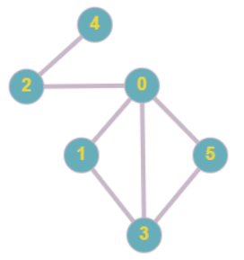

# Shortest-Path-Navigator

## Purpose
Derives the shortest path between two nodes in an undirected graph.

## Definitions
**Undirected Graph:** a set of objects (called vertices or nodes) that are connected together, where all the edges are bidirectional.

**Vertice:** the fundamental unit by which graphs are formed.

**Edge:** a bidirectional line which connects an unordered pair of vertices together.

**Shortest Path:** the shortest possible path which can be traversed to reach one node from another.

## Project Setup
You must first install CMake to initiate the build sequence:
```
sudo apt install cmake
```
To initiate the build sequence from scratch, use:
```
$ cd Shortest-Path-Navigator && mkdir build && cd build && cmake ../ && make
```
To run the program:
```
$ cd Shortest-Path-Navigator/build/
./shortest
```

## Commands
To specify the maximum number of vertices in the graph: 
```
V 6
```
To specify the edge list for the graph: 
```
E {<0,1>,<0,2>,<0,3>,<0,5>,<1,3>,<3,5>,<2,4>}
```
To derive the shortest path between one vertex to another in the specified graph:
```
S 5 2
```

## Example

**Input:**
```
V 6
E {<0,1>,<0,2>,<0,3>,<0,5>,<1,3>,<3,5>,<2,4>}
S 5 2
S 3 0
```
**Output:**
```
5-0-2
3-0
```
**Graphical Representation:**




**NOTE:** graphed using Graph Online: https://graphonline.ru/en/

